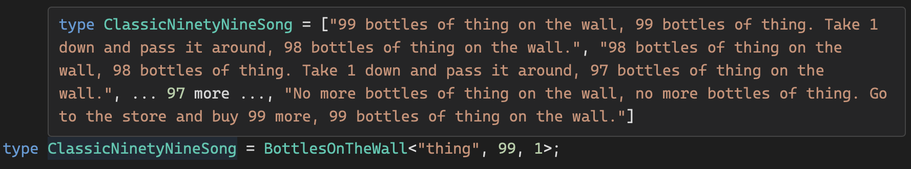
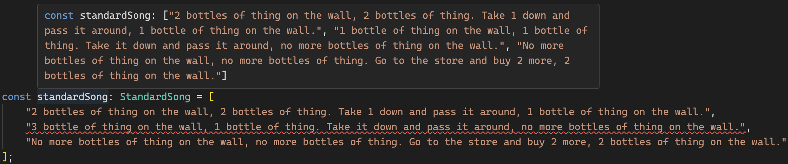

[](https://www.typescriptlang.org)
[](https://lbesson.mit-license.org/)
# 99 Bottles of Thing
This repository is an experiment in using advanced TypeScript features to generate the '99 Bottles of Thing' song entirely at compile time. While primarily a demonstration of recursive and conditional types, it showcases the flexibility and power of TypeScript's type system. 

Writing this was just a fun way to explore TypeScript's type system and its capabilities. It's not meant to be practical or useful in any way. It was created more as a "Can I do it?" rather than a "Should I do it?" kind of project.

<p align="left"><em>Example: Full Song being typed at compile time</em></p>


<p align="left"><em>Example: Showing what happens if the input is incorrect</em></p>


##### :white_check_mark: Check it out in the [TypeScript Playground](https://www.typescriptlang.org/play/?#code/C4TwDgpgBAQgrgSwDYBMCCAnDBDEAeAGQgDsBzYACyggA9gSUBnKYuAWwCMIMAaKNAMYDqdBszjEA1sQD2Ad2IBtALpQAvFBUA+dQCgoB-kMUByJCXIUTq2vWJMoRMpSgB+I8IBcsRKkw58J0s+RQlpeWI+ADoYwQFlLQBuXV1QSCgAZTgOYBwBYDw0ETsHVk5uPhhisRZ2LgwdNX1DeGR0LFxCnVsaxRio1r8O-BgtaJiEYgAzbigAJQhGYGVmg3cFpdNzZysVwyhvYggAN25k1PBoGBlgYHNGAHliABUKCAB1bCQkPFXM6vszCWGEmpB4fwAcgDSnUKn9nthJNAeoDauVeH84tCgblQSp1JplOD9hlgNgMMBsWj6gSIbpGlAoSiHAAGP7uRR-fb9OLE-aGAAGEJkUDYMgw0A4NzuiygMimUAAJABvDIAXzlxCglGgci+SD4slF4sl0vucoVKvVUSgAHERcAHW8oEsTVBsPYoBw4CAlaqyRSNWKJXwrQHgBqpbdzfK-erNdrnXrvlEBX89oZvEzRKiAIzs2BmxZPV4ffW-fmGDJ8ytZHJ5AoQvgIpFjLmGFsQGv8zmVys8oTdvtQAUqiGRosWuMamRanVQZMGv3jr2T2NWtU2ztQBCUlARd2esDYRjMXfujAyCQoQ0i4Om6Oy9eqmdzpP61PtgxEr+ZcN-LQ-m8OtcmwfI8CbKBO26HNShObgC2uR9HheN5Pm+Cs+2rX8WSHDtES7X9e2HQwBwEPDK1HZUVyjGUxypXM3CgAAiZiDhYxhmJnS0XwTedF1DaiJ0fejmWYRj3FY9jmM47jpy3Ai-U7DV9wUQ8UCgY9Tx3SlySvexb2NCVV2QqcNz498UzTYcf2HUlyWAACgMLZCSzQ8tf2wuzslA8DIOgiioIIwLiJIqAyMC-YqJootRNg8SmKk7wZK4szeNnRNdX1QSYpE6iGMStjktktLrSCpElIIlSDw9DStLPXTL2vQSQIbCDmwImCSmYFlEqNe8isyHy2v8zrf32YS6NVYawMbDrWwKyTBpS8bDDk8yMv4j9rL7WysP-fYkhSC50ns+xyRQDJZ1IAkkJlFDS3Qn5mMoUFmL4AAmPhcyOgRZyWF0yXOjBLuu4CgZQC6rrIAlQpYj6TPuqdXphzbLKXBHaJjBUUdIBSKsY1StVqzSTwai99JvKBGKx6BY1xiyspTd6-mYmm1xxihQUZhdsupxHzGRrmyHx6BzyJ9TSe0889Oalg7zdWnmHp4WbrRpmkCiFn9mY4UjIfJGVe59Xee+Qz7wFp9OdBG17W1J1oFdYySe9X0EfvT7LeV63UbfDWtd0ZRzjSaArsh6Gbo0O77jcssMJkmRIfeqAvup37-spRhE+wCPgOziPYdZzGi29l1s55gSU69qcs8h0X+Ylkn6p0im5fZx8a-Lk3Fy17s2ctzvIYrvn25lQfsHr8WaqPMmW9lgz5f16vY1r7Bh+Zvu9YtpXx-Xpd+sVkvx9th0HcBt0XZ9KuParneV67v3Tc15jA+Dy5HHJUgIFJCAwALqOS6xyengF6qtk65lwindOxAAZIE-t-egf8wYfwwF-H+SCYYaDhmzXqd8fZq0fpXCBy98H1wRo3Ge0tGqUz4AADhIYmY2hCPza0MMxeheDGG+0yk-OhDDcZkKgBQuqs8ZZNQXgANn4arPevdWZSM4QzbufMFFHyNiLcq0ByHTxEVQ1uC8AAs0imE8J7qwgwzEjGKJkcos2UArFqNIZoquwipbk3nlTYupl1EENMSwvuXjDb4L3p7axNtnHaLUk3UR1C5YH2MmE7hW0N6sy3ofbxwTbH7wVgkxxXC8Z2lPjwp20BL6+mITfYhiTfHJOfq-FIIcoAPBQCgAAIhAAQEo2AkGAP-Fy90gHllAW9PgABWPgABmaBANE5tI6V0npucmktPaZ0iA3TiC9OuoXHWozjFJPRmM-ZBTtwTKETotxc9xGeOObI8x8NblZNCXkgRzizmuObmImhi9t4vJscwlJOs0m5IyfkkJPz0lBPySfe2xTHTO09K7KAeyb57OqXc+pugAD0WKoKLEpAAYRPLKKY4ooAAFEaCQHyBADS5KsDikYNi3FRLGAQG8AAWQQKebmpwMBsuVhgHcxA-pYA6ZSMAFAcCMFBCdaA9LLwYCeFynlZAABq3A2W3UAahOOz1cbJ1Tj9ZIf0YGUm4Iq5V3KZXqs1eyilDKlXEBVTa0gGr+XQCwUXR5AKMbHProTC5nzYkL1HoLHxdzuw4qgC6ph0AJQAEdEASg0nytlqSckG2xmCp5EKQVQteXbR0cKL6Iqvu7E0zzQVKN9QHIOKRo2svtQASRFeKCU+QoB-QkHueZ6yelyodZa4gqyFmbO1a5XVwDhlkGThM760zzWOqeKO-tmzvAKvFCuvtGzKRep1mc9FubD1-PCduQNUTKHuOuVWgt-y-GAsMNG1toqO29rWbuqAxwvhwAgN6o9vrb3ZteduSJxMr1XO+fErNVsc21pfvW5lUAm3eBfe28VOl1ksGwN0wdm6nXNvoGwCEOHPX9JjlOoZBrPoLpNRnagy7iCEfWSR7pG7GPMeI6RnZT7cWcew900U3K2DYGAAICg-68mr3BYE7Nq8A3nMvbo693yw10wVNJrJcj9jPqIwJ6AbBhOifE6zNTu9c1mfvnXZxU8lOXK+XEzNDDNPwajXxvTxBuOGcYCJsTEmgVOc4S5h92Sl5BezjC4t84SmSyRRWkMt8pMPxC3Wt+6QHgg24LSvp0diyUfjtRqA8607nGjc8fFyHiXeAeHAYAABaeUDXMtCrTYsXQpqAaTFfeKjLKBuBLN61l0GmDNB-Gje6rVCNuWaTgQIWlXoICkuMhN6A+YdaydgzWkLQHNuqwUx8mJ+iqaWcya51mJ7q33tqZM-1ziL3geU5BuWG3S5bdqdpthJ24Pbf5rTIWZ7FK2Ye-ZkNVNoM+pS-c3WgXT0HI1ubSFwG9uFNhdF+FpSy2+jOTfC7d6THvYQ6V3F5WAYoZjda7ma9WvCpdBAJNJA5vtfo9511K2BvNey9s-dvGoArartNlnsqD0Q+u0V2757FPA+DUdnbr2rvow+xYr7b3Dm-Y5tCmze4g2HY8Qj-NSP8cK6h8CmDcvDfw7zab-7Gii1nxi2UsXOORdG8xWVirZPWlwDAEgBAAhRPzda0yjre4vc+79-QFAK3GDs76ymvpcNxt2v58wFAofff+5QOd53FvccG40RLg7ejdeJcu+bp+iuHkAZ+y963JzFL3cltL4vyv5f+yhzXiNuaO9OIL9rovN61cd072dnWLey9EIHj4yeWu7NN4H+DqvBPN4w9L3D3hlvbu25LQijSSLseVrF4vl3iHG1wJ5cIZiABOS-5HYOvDepka6g6CVn5lQICEkwICgA-0cHLOrHpUZgJ8DX60ZM5mpdqv6+5LIv5ky+4-5f4gDwHx6szX7Z7r6oHVL7Z94qZyyX4cKw41JG59x4FoGVwkGYF3aS6N464D6X4ADspB-iKBDBR+Fu9B4u9eVB0S-e3yl+qiq+hBbexB-BeOa+ZBIheedeBMXBEGDmC8l+aKBBkaKBihAh4KChHB0hheOB8hDiahWmUOl+ehohgh6BxhkhWBs+NBvBueu24+TBOsl+thZuYhfMThmhq2Mhj2chVMl+3e32S+KB-hKubBwRyOveVhPBuBamLhphZixBMRte6hiRU+lB2hT28huCShBhxBWR+hgGUAl+eRJhlhUu1hcstCN+rB5eUOlRjBdidRFBERZRURC8tC+B+RkOfc7R9RS4PRTRnB6RPhdCLB2RI+bCtCoxnRoukxHhDc2BGRVMtCEhdhrhj6FiyxvRdCKxsRpR1BrRSxqhJhyhOstCRxkh4KZxcxDe3BOhSx5hqxcRDhExDxsRlxrxteextxixdCzhSRORrMtCfxw+P2QJ1xXhIOMuUAtCYR9h6xLEMJWx0JsJ+egxCxwx0JKRp2XRgJWJARqutCeJIGaJkRdxdCxRFxAJpxFJjxlxNJuxaR6JoOfAdBVRYxOJOsrJSJXJAxWhTJUJdBHRxxVJbCgp3JQpFhjJpJPxUAdBUxwp4xFicp3J8pkpzR+xZJspOx-xipLEdB2pIJou+p4JQxzJsp5xtJIpSpFpbxuadBNpnxUpLRmpdBHxhpRBrMrp3JbpPeJJzpMpdBwJ2JgRnJQZ+JFugZJp-JxedBKJTx8JzEsZ3JcZXxshZpdBRJreNRfcGZ3JmZAOfJ0pGJdB9JOpHJoppZ7pEZlZvphZ-pGJEibJ0xHpOsjZSJbZvJnhppUJEiEplpupzEvZ7ZfZDJ6p3xDZqp-Z5ZFiEik5tpBRs5UZRZZpEiBpwZLZbCq57Za5GuY5aZPZDpVZ2Z8ih565FuEip5u5fpGpMpEiPp4Zx5rZ95IR6+d5S59ZK5YZL58R8iX5WZlcEif5BZXZ0ZA+EicZJxm5EFua4F75N5DZ+Zaxz8fcEiiF8ZS4qFcF45K5NZD5P5rZuF35KihF4R152FUJoyTZCp05LElFSJdFnZ8xy5FFI5ZZIZbCoyrFR5lcnFWF+5xeoyc5bFG5Figl9FQlqRe53hZpoyO5RFCZsl9FclpFdZ8FMll58lyFrMoyGl-5fMOlfF0lFFz5elClJlcJS4oy5lqJql5FAlQFSFFezEoyDl6FYyrlqZRlAl0FA+oyPlP2flhlkJAlaFkFoloVuaoyaFnlwVA+oyJFFlTl8V9FCVNlIFzFxeBiVFlJA5WVSJeVjFNx-FA+BiXFZ5j5bCpV+VZVV5tlxV3yBiEl5V+FlVTVeFfMjVQVc+DVyliVUOBivVSFfAA1XV5RhiulfVfcBiE1Q19iM1Uh6VH5UJBi1l6FTlK1+Vq1MV3VcsBirlYVLEe1+VHlTpaly1-l7FFiBiF1qu11o1Bxw1EVuVT1P2Bi0Vp1dlJVqVa1-V314KBi3121Y1VMEy2VU5l1LEoNSJUNhVEJO1C8EyNVmlTliN0NSNKli1Z1xeEybVyNUOON0NuNGNTFS12Ng1P1fcEy5N4KVN91mpEy81B1zEDN0N81QND1RWq1TNEyXNx6W1H19VcsEy+1VpkNItBRwtdNMpEyN1Qh52st6+MtUtGJEyL1ENzNatquqtytZpEyf1otzN+tEtgNAtXlA+H0YN85NFzEFtSJttsN3ZxeH06Nk1RcLts1ztOtUJH0RNrt62vtHtAdC1JNWN5t1NBtH04dBRkdXtTtjNEd8d0dbNptsV3yH0vNA56ddt-NUlqdz24t1tH0BdouRdsd5tCtLVFiH0FdfM1dZdadmtct62jd6+H071ud8NniRthd3dJdJtHdwN30ltwlTdn2w93FI849tZmNn1qm7tFNpm894KuY897NmpuYQdTNG9SJ29DtoFqmUd1tuYh9oux99dbcidR9l9p9ydA9HNuYGdR9j9p9OdZFgtoaxdIlLEuYn9FuP959oaNdCZuYQDS4IDADx2Ldld39UDI87db9ZtqmvdX9OCO9-dCDed8hvRTlU97VdiuDxJdViDFR2DtRSJq9KdndLJpDOZ3JEDfAJ9KDjD559DyKND2l9FrDz9KD3DFur9RDmDIN7Dwu1RlcJ1d9mpoDTloDsujpEjMpY+jlUOijblg+Y8klgOM+pN8+K+1F6tJuSJC+BBkWdu6OsWV8qBN8GB7JBOr8QAA)

## Features
- **Fully Customizable**: Specify the bottle type (`thing`), starting count, and decrement value.
- **Compile-Time Validation**: Ensures the song is type-safe and correct, catching errors such as misordered verses during development.
- **Educational Experiment**: Explores the potential (and limits) of TypeScript's type system for solving complex problems.

## Example
Here are examples demonstrating how you can customize the song by modifying the bottle type, starting count, and decrement values. These variations are fully type-safe, ensuring correctness at compile time.

#### Quick Example

```typescript
import { BottlesOnTheWall } from "./99-bottles-of-thing";

type Example = BottlesOnTheWall<"thing", 2, 1>;
const song: Example = [
    "2 bottles of thing on the wall, 2 bottles of thing. Take 1 down and pass it around, 1 bottle of thing on the wall.",
    "1 bottle of thing on the wall, 1 bottle of thing. Take it down and pass it around, no more bottles of thing on the wall.",
    "No more bottles of thing on the wall, no more bottles of thing. Go to the store and buy 2 more, 2 bottles of thing on the wall."
];
```

#### With a different `Thing` type
```typescript
type SodaSong = BottlesOnTheWall<"soda", 2, 1>;
const sodaSong: SodaSong = [
    "2 bottles of soda on the wall, 2 bottles of soda. Take 1 down and pass it around, 1 bottle of soda on the wall.",
    "1 bottle of soda on the wall, 1 bottle of soda. Take it down and pass it around, no more bottles of soda on the wall.",
    "No more bottles of soda on the wall, no more bottles of soda. Go to the store and buy 2 more, 2 bottles of soda on the wall."
];
```

#### With a different `Decrement` number
```typescript
type LargeStepSong = BottlesOnTheWall<"thing", 10, 2>;
const largeStepSong: LargeStepSong = [
    "10 bottles of thing on the wall, 10 bottles of thing. Take 2 down and pass it around, 8 bottles of thing on the wall.",
    "8 bottles of thing on the wall, 8 bottles of thing. Take 2 down and pass it around, 6 bottles of thing on the wall.",
    "6 bottles of thing on the wall, 6 bottles of thing. Take 2 down and pass it around, 4 bottles of thing on the wall.",
    "4 bottles of thing on the wall, 4 bottles of thing. Take 2 down and pass it around, 2 bottles of thing on the wall.",
    "2 bottles of thing on the wall, 2 bottles of thing. Take 2 down and pass it around, no more bottles of thing on the wall.",
    "No more bottles of thing on the wall, no more bottles of thing. Go to the store and buy 10 more, 10 bottles of thing on the wall."
];
```

#### With an odd `Decrement` number
```typescript
type OddDecrementSong = BottlesOnTheWall<"thing", 5, 3>;
const oddDecrementSong: OddDecrementSong = [
    "5 bottles of thing on the wall, 5 bottles of thing. Take 3 down and pass it around, 2 bottles of thing on the wall.",
    "2 bottles of thing on the wall, 2 bottles of thing. Take 3 down and pass it around, no more bottles of thing on the wall.",
    "No more bottles of thing on the wall, no more bottles of thing. Go to the store and buy 5 more, 5 bottles of thing on the wall."
];
```

See more examples (and error cases) in the [examples.ts](./src/examples.ts) file.

## How it works

### 1. `BuildArray` Utility Type
```typescript
type BuildArray<Length extends number, Acc extends unknown[] = []> =
    Acc['length'] extends Length ? Acc : BuildArray<Length, [unknown, ...Acc]>;
```

This recursive type creates an array with a length equal to a specified number `Length`. It works by incrementally adding `unknown` elements to the accumulator array `Acc` until its length matches `Length`.

**Purpose**: It serves as a foundation for performing type-safe arithmetic by leveraging the array's `length` property.

### 2. `Subtract` Utility Type
```typescript
type Subtract<A extends number, B extends number> =
    BuildArray<A> extends [...BuildArray<B>, ...infer Rest]
    ? Rest['length']
    : never;
```

This type performs subtraction on two numbers, `A` and `B`, using the BuildArray type. It essentially "removes" the elements of `BuildArray<B>` from `BuildArray<A>` and calculates the length of the remaining portion.

**Purpose**: Provides a type-safe way to subtract numbers in TypeScript.

### 3. `BottlesOnTheWall` Type
```typescript
export type BottlesOnTheWall<
    S extends string,
    N extends number,
    Take extends number,
    Acc extends string[] = [],
    Start extends number = N
> = ...
```
This is the core type that generates the song lyrics. It takes several parameters:

- `S`: A string representing the type of bottles (e.g., "beer").
- `N`: The starting number of bottles.
- `Take`: The number of bottles to take down in each verse.
- `Acc`: An accumulator that stores the lyrics as they are built.
- `Start`: The initial number of bottles (preserved for the final verse).

#### Recursion Details
1. **Base Case (No Bottles Left)**: When `N` (current bottle count) reaches 0:
```typescript
N extends 0
```
It adds the final verse:
```
"No more bottles of [S] on the wall, no more bottles of [S]. Go to the store and buy [Start] more, [Start] bottles of [S] on the wall."
```
2. **One Bottle Left**: When `N` equals 1:
```typescript
N extends 1
```
It adds the singular `bottle` form of the verse:
```
"[1] bottle of [S] on the wall, [1] bottle of [S]. Take it down and pass it around, no more bottles of [S] on the wall."
```
3. **General Case**: For all other values of `N`, it uses the `Subtract` type to compute the new number of bottles after `Take` have been removed:
```typescript
BottlesOnTheWall<
    S,
    Subtract<N, Take>,
    Take,
    [
        ...Acc,
        "[N] bottles of [S] on the wall, [N] bottles of [S]. Take [Take] down and pass it around, [Subtract<N, Take>] bottles of [S] on the wall."
    ],
    Start
>
```
4. **Edge Case (Take More Than Remaining)**: If `Subtract<N, Take>` results in `never` (i.e., `Take` is greater than `N`), the type reduces `N` directly to 0 and adjusts the verse accordingly:
```typescript
Subtract<N, Take> extends never
```

## Aknowledgements
- This project was inspired by [12-days-of-christmas-type-solver](https://github.com/eamonnboyle/12-days-of-christmas-type-solver/tree/master) by [Eamonn Boyle](https://github.com/eamonnboyle).
- [Matt Pocock](https://www.totaltypescript.com) for his excellent tutorials on how to be a TypeScript wizard.
- [Andrew Burgess](https://www.youtube.com/@andrew-burgess) for talking through challenging TypeScript concepts.
- [TypeScript Subreddit](https://www.reddit.com/r/typescript/) for continuous inspiration and learning resources.

## License
This project is licensed under the MIT License - see the [LICENSE](./LICENSE) file for details.

## Connect with Me
[](https://www.linkedin.com/in/kevin-cooper-539a6194/)
